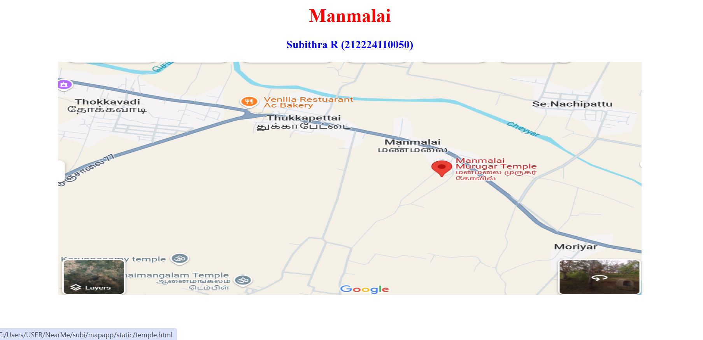
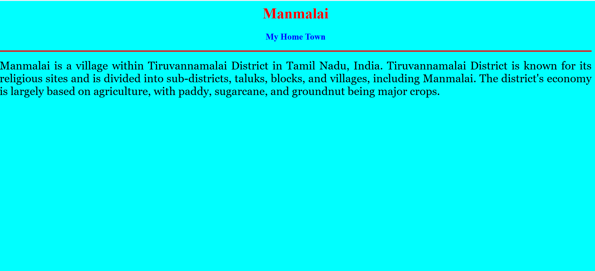
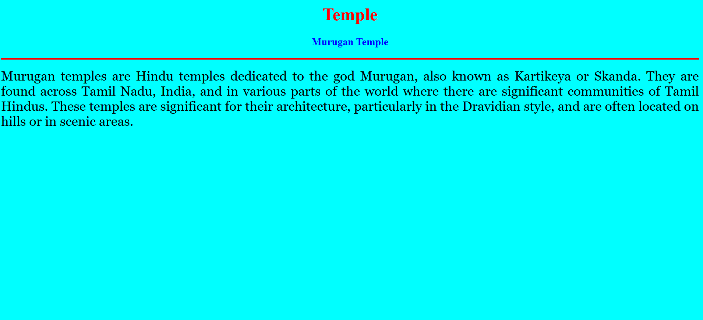
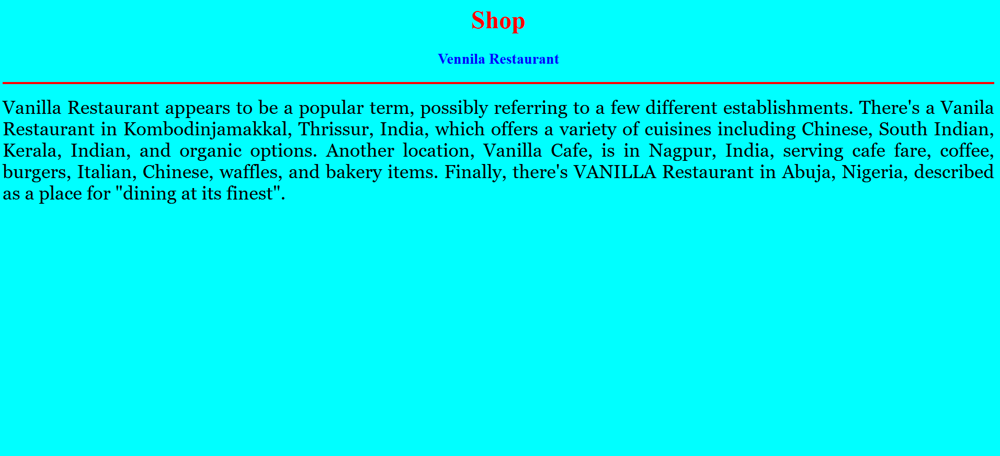

# Ex04 Places Near Me
## Date: 17/04/2025

## AIM
To develop a website to display details about the places around my house.

## DESIGN STEPS

### STEP 1
Create a Django admin interface.

### STEP 2
Download your city map from Google.

### STEP 3
Using ```<map>``` tag name the map.

### STEP 4
Create clickable regions in the image using ```<area>``` tag.

### STEP 5
Write HTML programs for all the regions identified.

### STEP 6
Execute the programs and publish them.

## CODE
```
map.html

<html>
    <head>
        <title>My city</title>
    </head>
    <body>
        <h1 align="center">
        <font color="red"><b>Manmalai</b></font>
    </h1>
    <h3 align="center">
    <font color="blue"><b>Subithra R (212224110050)</b></font>
    </h3>
    <center>
        
        <map name ="Mycity">
            <area shape="circle" coords="570,230,45" href="home.html" title="My Home Town">
            <area shape="rect" coords="100,100,900,900" href="temple.html" title="Temple">
            <area shape="poly" coords="100,100,900,900" href="shop.html" title="Restaurant">
        </map>
    </center>
    </body>
</html>

 home.html

 <html>
    <head>
        <body bgcolor="cyan">
            <h1 align="center">
                <font color="red"><b>Manmalai</b></font>
            </h1>
            <h3 align="center">
                <font color="blue"><b>My Home Town</b></font>
            </h3>
            <hr size="3" color="red">
            <p align="justify">
                <font face="Georgia" size="5">
                    Manmalai is a village within Tiruvannamalai District in Tamil Nadu, India. Tiruvannamalai District is known for its religious sites and is divided into sub-districts, taluks, blocks, and villages, including Manmalai. The district's economy is largely based on agriculture, with paddy, sugarcane, and groundnut being major crops. 
                </font>
            </p>
    </head>
</html>

temple.html

<html>
    <head>
        <body bgcolor="cyan">
            <h1 align="center">
                <font color="red"><b>Temple</b></font>
            </h1>
            <h3 align="center">
                <font color="blue"><b>Murugan Temple</b></font>
            </h3>
            <hr size="3" color="red">
            <p align="justify">
                <font face="Georgia" size="5">
                    Murugan temples are Hindu temples dedicated to the god Murugan, also known as Kartikeya or Skanda. They are found across Tamil Nadu, India, and in various parts of the world where there are significant communities of Tamil Hindus. These temples are significant for their architecture, particularly in the Dravidian style, and are often located on hills or in scenic areas. 
                </font>
            </p>
    </head>
</html>

shop.html

<html>
    <head>
        <body bgcolor="cyan">
            <h1 align="center">
                <font color="red"><b>Shop</b></font>
            </h1>
            <h3 align="center">
                <font color="blue"><b>Vennila Restaurant</b></font>
            </h3>
            <hr size="3" color="red">
            <p align="justify">
                <font face="Georgia" size="5">
                    Vanilla Restaurant appears to be a popular term, possibly referring to a few different establishments. There's a Vanila Restaurant in Kombodinjamakkal, Thrissur, India, which offers a variety of cuisines including Chinese, South Indian, Kerala, Indian, and organic options. Another location, Vanilla Cafe, is in Nagpur, India, serving cafe fare, coffee, burgers, Italian, Chinese, waffles, and bakery items. Finally, there's VANILLA Restaurant in Abuja, Nigeria, described as a place for "dining at its finest".  
                </font>
            </p>
    </head>
</html>


```


## OUTPUT







## RESULT
The program for implementing image maps using HTML is executed successfully.
